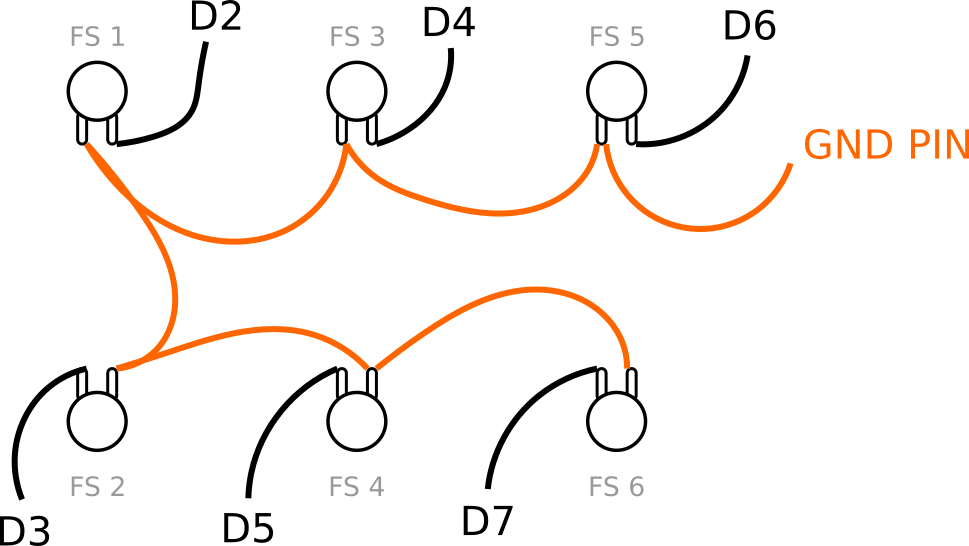
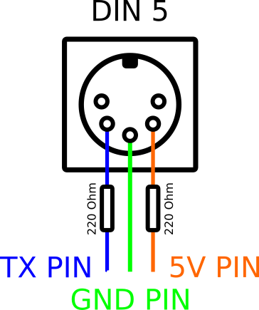

## Load firmware

This repo contains PlatformIO project with firmware for your controller. Please follow [official guide](https://docs.platformio.org/en/latest/core/quickstart.html) and upload code into your arduino nano board.

See [UPLOADING](./UPLOADING.md).

## Wiring

## DIN 5 socket

## LCD

Connect lcd with provided instruction. I2C should have 4 pins. Connect GND to GND pin, VCC to 5V pin.

If you are using the arduino nano board, SDA should be connected to A4 pin, SCL to A5 pin.

## Power supply

Power whole board using usb or connect selected power source (for me the best choice is 9V battery) to GND and VCC pins of arduino board.

## Is it everything?

Yup. Easy, right?

## LED + expression pedal modification

This modified firmware adds:
- six footswitch status LEDs using one 74HC595 shift register;
- one passive expression-pedal input on A0;
- expression MIDI CC configuration from the controller menu.

### 74HC595 wiring

Use a 74HC595 powered from 5 V:

| 74HC595 | Arduino Nano |
|---|---|
| SER / DS | D8 |
| SRCLK / SH_CP | D9 |
| RCLK / ST_CP | D10 |
| OE | GND |
| MR / SRCLR | 5V |
| VCC | 5V |
| GND | GND |

Q0..Q5 drive the six LEDs through individual resistors (recommended 1 kOhm for indicator LEDs).

LED mapping:
- Q0 = FS1
- Q1 = FS2
- Q2 = FS3
- Q3 = FS4
- Q4 = FS5
- Q5 = FS6

### Expression pedal jack

Use a TRS 6.35 mm jack for a normal passive expression pedal:

| TRS jack | Arduino |
|---|---|
| Tip | A0 |
| Ring | 5V |
| Sleeve | GND |

A 100 nF capacitor from A0 to GND can help suppress noise. A 10 kOhm to 1 MOhm pulldown from A0 to GND may also be used so the input has a defined state when no pedal is connected.

The expression input is an **input to the controller**, not a MIDI output. It sends MIDI CC messages over the controller's existing MIDI output.

### Expression configuration

Press FS5 + FS6 together in normal SEND mode to open the expression configuration.

During expression configuration:
- FS1 = decrement
- FS2 = increment
- FS4 = next/save
- FS5 + FS6 are not used for commands in this mode

The menu configures:
1. Expression ON/OFF
2. MIDI channel 1..16
3. CC number 0..127
4. MIDI minimum 0..127
5. MIDI maximum 0..127
6. Reverse ON/OFF

The firmware averages four ADC readings and sends a new MIDI CC only when the resulting value changes.

### LED behavior

- TOGGLE CC: LED stays on when the configured ON value (`value2`) is active.
- Other footswitch commands: LED flashes briefly when the command is executed.
- When changing pages, toggle LEDs are restored from their per-page toggle history.

### EEPROM compatibility

The original footswitch configuration remains in its original EEPROM area. Expression settings use EEPROM addresses 720..726 and a small magic byte, while USB mode remains at address 800.

## Added hardware: LEDs and expression pedal

### Six LEDs (directly from the Arduino Nano)

No 74HC595 is required. The modified firmware uses these previously unused GPIOs:

| LED | Arduino Nano |
|---|---|
| FS1 | D8 |
| FS2 | D9 |
| FS3 | D10 |
| FS4 | A1 |
| FS5 | A2 |
| FS6 | A3 |

Connect each LED through its own 680R–1k resistor to the corresponding pin. LED cathodes go to GND.

### Expression pedal

| TRS jack | Arduino Nano |
|---|---|
| Tip | A0 |
| Ring | +5V |
| Sleeve | GND |

A 100 nF capacitor from A0 to GND is optional and can help reduce noise.

### Expression configuration

The original footswitch configuration menu is unchanged. In normal SEND mode, press FS5 + FS6 together to open the separate expression menu.

FS1 = decrement, FS2 = increment, FS4 = next/save. Settings are stored in EEPROM at addresses 720–726.

Expression settings: Enable, MIDI channel, CC, minimum, maximum and Reverse.

## Modified version notes

### LEDs
The six LEDs are driven directly by the Nano. A 220 ohm series resistor can be used
for each LED. Firmware limits/controls indicator brightness so the LEDs do not need
to run at full visual intensity.

### Expression calibration
The Expression menu includes HEEL CAL and TOE CAL. During calibration, place the
pedal fully heel-down or toe-down as requested and confirm with the designated
footswitch. The measured ADC endpoints are stored in EEPROM and mapped to the
configured MIDI MIN/MAX range.
