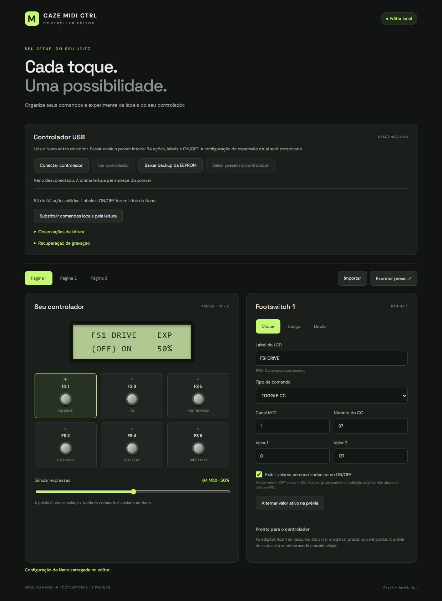

# CAZE MIDI CTRL

Controlador MIDI para **Arduino Nano ATmega328P**, com seis footswitches, LCD 16×2, LEDs, pedal de expressão e editor web em React + JavaScript.

> Adaptação independente do [Open Midi Controller, de galczo5](https://github.com/galczo5/open-midi-controller). A autoria original e a licença recebida foram preservadas. Veja [créditos](docs/CREDITS.md).

## O que ele faz

- **54 ações:** seis footswitches × três páginas × clique simples, longo e duplo.
- Program Change, CC, CC Toggle e navegação de páginas.
- Labels ASCII de até 12 caracteres, salvos no Nano.
- Indicador de expressão à direita do LCD, com percentual do MIDI final.
- Calibração de calcanhar/ponta, MIN/MAX, canal, CC e REVERSE.
- Tap tempo local para CC42: média dos últimos quatro intervalos.
- Editor com prévia do LCD, presets JSON, Web Serial, leitura e gravação verificada.
- Backup antes da gravação e recuperação após envio interrompido.

```text
TAP TEMPO    EXP
120 BPM      75%
```

O envio MIDI funciona sem o computador. O editor é usado para configuração; seu controle de expressão é uma simulação, não telemetria do board.

## Começar

### Conheça o editor web



*Captura real do editor, com um preset carregado e o Nano desconectado. O percentual de expressão mostrado é uma simulação.*

| Área do editor | O que você pode fazer |
|---|---|
| **Controlador USB** | Conectar o Nano por Web Serial, ler a configuração, baixar um backup da EEPROM e gravar o preset completo com conferência por releitura. |
| **Páginas e footswitches** | Selecionar uma das três páginas e um dos seis footswitches, na mesma disposição física do board. |
| **Clique, Longo e Duplo** | Configurar separadamente os três gestos de cada footswitch, totalizando 54 ações. |
| **Prévia do LCD** | Visualizar o label, os valores do comando e o indicador EXP antes de salvar. O slider simula a expressão; não movimenta nem lê o pedal real. |
| **Comandos e labels** | Escolher o tipo de comando, canal, número de CC/programa, valores e um label de até 12 caracteres sem acentos. |
| **CC Toggle e ON/OFF** | Alternar o valor ativo na prévia e exibir valores personalizados como OFF/ON, mantendo os números MIDI e os parênteses do valor ativo. |
| **Importar / Exportar** | Levar presets JSON entre computadores ou entre localhost e o site publicado. O rascunho também fica salvo neste navegador. |
| **Recuperação** | Repetir uma gravação interrompida usando o preset e o backup guardados antes do envio. |

As alterações só chegam ao Nano ao clicar em **Salvar preset no controlador**. A calibração física da expressão é feita no menu do board; o BPM de CC42 é calculado pelas pisadas no controlador, sem telemetria ao editor.

### Firmware

Instale PlatformIO e abra a raiz deste projeto:

```sh
pio run -e nanoatmega328
pio run -e nanoatmega328 -t upload
```

A placa testada usa **`board = nanoatmega328`**. Desconecte o editor/monitor serial antes do upload. Após migrar os presets para o mapa v2, não instale o firmware antigo diretamente: ele interpreta os endereços de outra forma.

### Editor local

Requer Node.js 22 e npm:

```sh
cd web-app
npm ci
npm run dev
```

Abra o endereço mostrado pelo Vite. Para conferir o app:

```sh
npm test
npm run build
```

### Editor online

É possível publicar o app no Netlify, sem depender de localhost. A configuração está em `netlify.toml`; siga [publicação por HTTPS](docs/DEPLOY.md). Ainda será necessário conectar o Nano por USB ao computador e autorizar a porta no navegador.

## Usar com o Nano

1. Instale o firmware atual.
2. Ative **USB MODE com FS4 + FS6** e saia dos menus físicos.
3. No editor, conecte a porta do Nano e clique em **Ler controlador**.
4. Baixe o backup e carregue a leitura antes de editar, se quiser preservar os comandos existentes.
5. Edite o preset e clique em **Salvar preset no controlador**. Isso grava as 54 ações, não apenas o footswitch selecionado.
6. Aguarde a confirmação pela releitura. Os labels funcionam mesmo após desligar o computador.

O modo USB usa serial a 115200 baud; o modo MIDI DIN usa 31250. O Nano com CH340 não se torna um dispositivo USB MIDI nativo. Para usar DIN, volte ao modo MIDI com a combinação existente.

## Guias

| Assunto | Documento |
|---|---|
| Hardware e pinagem atual | [BUILD.md](BUILD.md) |
| Menus, footswitches e uso | [MANUAL.md](MANUAL.md) |
| Upload | [UPLOADING.md](UPLOADING.md) |
| Gravação, EEPROM e recuperação | [USB-WRITE.md](web-app/USB-WRITE.md) |
| Calibração da expressão | [EXPRESSION-CALIBRATION.md](EXPRESSION-CALIBRATION.md) |
| Tap tempo | [TAP-TEMPO.md](TAP-TEMPO.md) |
| Hospedagem gratuita/HTTPS | [DEPLOY.md](docs/DEPLOY.md) |
| Evolução por etapa | [CHANGELOG.md](CHANGELOG.md) |
| ZIPs e reconstrução Git | [HISTORY.md](docs/HISTORY.md) |
| Origem e licença | [CREDITS.md](docs/CREDITS.md), [LICENSE.txt](LICENSE.txt) |

## Estado e limites

Firmware e editor foram desenvolvidos e testados incrementalmente no board do projeto. O usuário confirmou o funcionamento da gravação, labels e tap tempo. A compilação não substitui testes na sua montagem; o comportamento elétrico depende do pedal, cabo e jack.

- Não há leitura do BPM interno da pedaleira: o número é calculado pelas pisadas.
- Os rascunhos e recuperação ficam no navegador; exporte-os antes de trocar de domínio/computador.
- A gravação não tem segunda cópia completa na EEPROM. Se interrompida, o Nano aguarda recuperação por USB.
- O mapa legado tinha sobreposições; dados já sobrescritos nele não podem ser reconstruídos automaticamente.
- O projeto não implementa uma entrada MIDI para sincronismo externo.

## Créditos e licença

Projeto original: **[galczo5/open-midi-controller](https://github.com/galczo5/open-midi-controller)**. Adaptação CAZE e testes: **Carlos Henrique (CAZE)**, com assistência de desenvolvimento do Codex. O arquivo MIT [LICENSE.txt](LICENSE.txt), incluindo o aviso de Francois Best presente na base, foi mantido intacto. Bibliotecas mantêm suas próprias licenças.

Os documentos herdados estão em `docs/*-inherited.md`; as fotos da base são do projeto herdado, não desta montagem.
